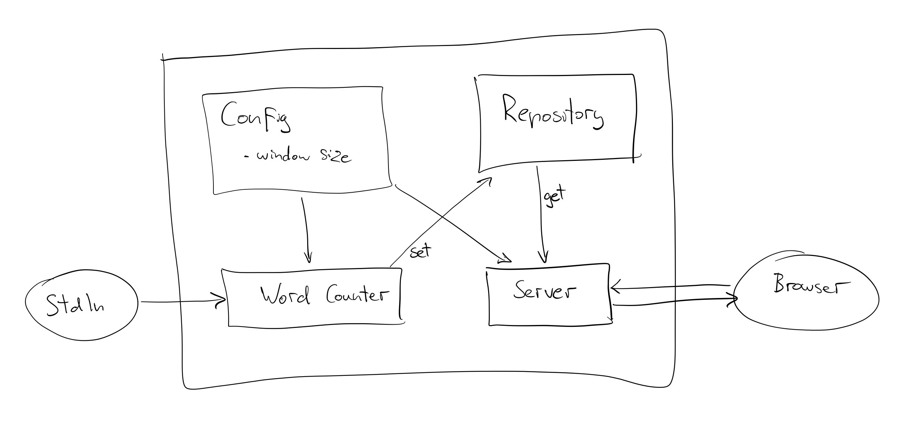

# Word counter

### Requirements
* read lines from stdin
* try parsing each line as json object with attributes `event_type`, `data`, and
 `timestamp`
* ignore lines that cannot be parsed
* perform a windowed word count, grouped by`event_type`
* maintain the word count per each window from the start of the application and 
expose the data over an HTTP interface

### Implementation
I've worked with the following stack:

##### ZIO Streams
The stream processing functionality can easily be expressed with a few of 
operators (`collect`, `mapAccum`, etc.)

##### ZLayer
I don't have much experience with `ZLayer`, so I'm not sure this was a good
idea. Nevertheless, I tried to structure the application into modules/layers, and while the
end result works, I hope the code is not fraught with anti-patterns.

##### uzhttp 
Even though its author consistently tells everyone that they should not use it, 
I went against his recommendation for the lib's native ZIO-based implementation
and extreme simplicity, which was ideal for the task.

##### ZIO Test  
I've written a unit test for the stream processing part, an end-to-end 
integration test for the whole app, as well as a property based test for a 
smaller function in the code.  

##### Circe 
For JSON encoding/decoding I went with the incumbent... I wanted to give 
zio-json a try, but ran out of time.

##### Quicklens
Comes in handy when dealing with structures nested at different levels 
(like the window-aggregated word counts of different event types).

### Architecture

Each box in the diagram corresponds to a (very simple) layer:

* [`Config`](src/main/scala/com/github/zagyi/wordcounter/Config.scala) is backed
 by a case class with a single attribute for the window size. This piece of 
 configuration is obviously required by the `Word Counter`, but also by the 
 `Server` that will include the window size in HTTP responses.
 
* [`Repository`](src/main/scala/com/github/zagyi/wordcounter/Repository.scala) 
 is backed by a `Ref` that the `Word Counter` uses to safely publish data to the
 `Server`.

* [`Word Counter`](src/main/scala/com/github/zagyi/wordcounter/package.scala) is
 backed by a simple class with a method that performs the aggregation on the 
 incoming stream of lines, while updating the `Repository` after each step.
 
* [`Server`](src/main/scala/com/github/zagyi/wordcounter/UZServer.scala) is 
 implemented with `uzhttp`, and handles any incoming `GET` request by reading 
 the `Repository` and serializing the accumulated data into a json response.
 
These layers are assembled in the app's entry point 
[WordCountApp](src/main/scala/com/github/zagyi/wordcounter/WordCountApp.scala)
where the two main components are run as the merger of two single-element 
never-ending streams, which ensures that both will be terminated if any of them
completes or fails. 
